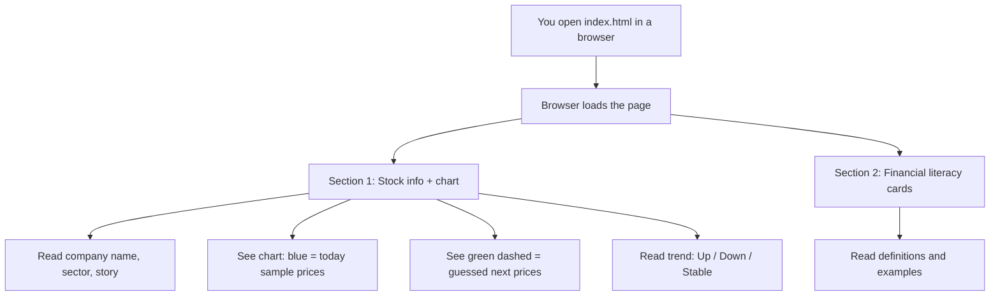
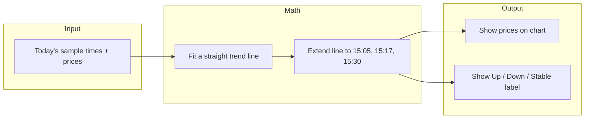
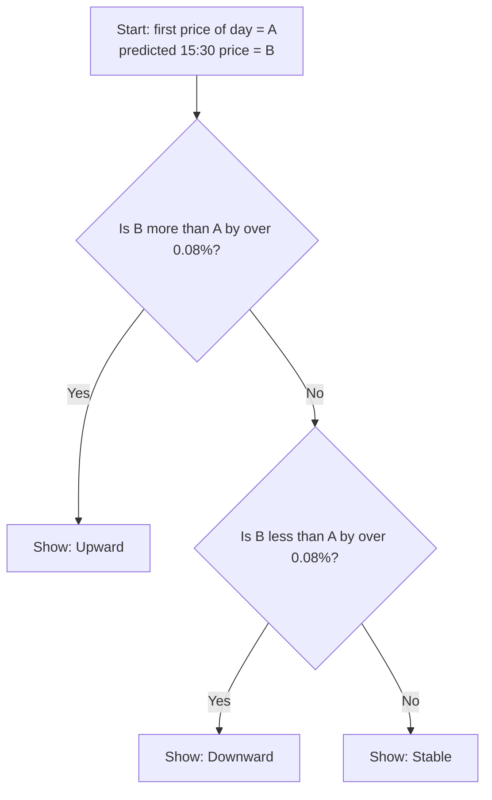

# Basic Stock Information and Prediction Platform

This is a **beginner-friendly student project**: one web page that shows **stock information**, teaches a few **money and market words**, and draws a **simple price chart** with a **trend prediction**. Everything runs in your **web browser**.

You do **not** need to install Node, Python, or a database. You only need a browser and (for the chart library) an **internet connection** the first time you open the page.

---

## What you will see on the page

| Part | What it does (simple words) |
|------|-----------------------------|
| **Stock block** | Shows one example company (TCS): name, sample price, sector, short description. |
| **Chart** | A line graph of **fake “today only”** prices at many times during the day. You can **hover** to see exact rupee values. |
| **Green dashed line** | **Guessed** future prices at three times (15:05, 15:17, 15:30), using math on today’s points only. |
| **Trend text** | Says if the guess for the end of the day looks **up**, **down**, or **flat** compared to the **first** price of the day. |
| **Financial literacy** | Cards that explain words like *stock*, *share*, *risk*, *dividend*, etc., with examples. |

**Important:** The numbers are **sample data** for learning. They are **not** live market prices from the internet.

---

## How to open the project

1. Put `index.html` on your computer (this folder is enough).
2. Double-click `index.html`, or right-click → **Open with** → Chrome / Edge / Firefox.
3. Stay **online** so **Chart.js** can load from the internet (the script tag in the page).

If the chart does not appear, check your Wi‑Fi and try refreshing the page (`Ctrl+Shift+R` on Windows/Linux, `Cmd+Shift+R` on Mac).

---

## Files in this folder

| File | Role |
|------|------|
| `index.html` | The whole app: layout, styles, sample data, glossary text, chart, and math. |
| `README.md` | This guide (for humans). |
| `AGENTS.md` | Optional notes for AI assistants working in this workspace (you can ignore it for class). |

---

## Big picture: flow when you open the page

This diagram shows the **order** in which your eyes (and the browser) move through the idea.

---

## How the chart and prediction work (simple)

Think of **intraday** as “many snapshots of the price **today**,” each with a **clock time** and a **rupee price.” The program:

1. Takes only those **today** points from a list in the code (`intradayToday`).
2. Draws them as the **blue** line (Chart.js).
3. Draws a **best-fit straight line** through those points in math (called **linear regression** — like drawing a ruler through scattered dots).
4. Extends that line to **three future times** today to get the **green** guesses.
5. Compares the **last guess (15:30)** to the **first price of the morning** to pick **Upward**, **Downward**, or **Stable**.

---

## How “Up / Down / Stable” is decided

The code compares the **predicted 15:30 price** to **today’s first price** (not to yesterday).

So **Stable** means “the guess is very close to the open,” not “the market stopped.”

---

## Prediction logic (what `index.html` actually does)

This matches the JavaScript in the page, in order.

### 1) Inputs

- **`intradayToday`** — a list of objects `{ time, price }`. Each `time` is a clock time on the trading day (for example `"09:15"`). Each `price` is a sample rupee value (demo data, not live).
- **`PREDICTION_STEPS`** — three future clock times the same day (for example `15:05`, `15:17`, `15:30`). The code predicts the price at each of these using the same math.

### 2) Turn times into numbers (x-axis for regression)

- The code assumes the session **opens at 9:15** (`MARKET_OPEN`).
- For any `"HH:MM"` string it computes **minutes after 9:15** (call this **x**).
- For each row in `intradayToday`, **y** = that row’s **price**.

So you get many **(x, y)** pairs: “how many minutes after open” and “price at that time.”

### 3) Fit one straight line (ordinary least squares, OLS)

The script finds the line **y = m·x + b** that best fits all of today’s **(x, y)** points:

- **m** (slope) = how fast the model says price changes per minute.
- **b** (intercept) = where that line would hit when x = 0 (mathematical anchor, not always a real traded price).

The implementation is **ordinary least squares** (the standard “best-fit line” through scattered points). The code also computes **R²** in the script (how closely the points hug that line: **1** = perfect line, lower = more zig-zag). It is **not** shown on the page right now, but you can log `predResult.r2` if you want to see it while learning.

### 4) Forecast the three future points

For each time in **`PREDICTION_STEPS`**:

1. Convert that time to **x** (minutes after 9:15), the same way as above.
2. Compute **ŷ = m·x + b** and round to two decimals.
3. Those three **ŷ** values are the **green dashed** segment (after the last real point).

The **blue** line uses only the real `intradayToday` prices; the chart stores `null` in the “future” slots for that series so the line stops and the green series continues the trend visually.

### 5) “Upward / Downward / Stable” label

- Let **A** = **first** price in `intradayToday` (today’s first sample).
- Let **B** = the **last** predicted price (the one at the final step, e.g. **15:30**).
- Compute **percent change** = **(B − A) / A × 100**.

Then:

- If **percent is greater than 0.08** → **Upward**
- If **percent is less than −0.08** → **Downward**
- Otherwise → **Stable**

So the label is driven by **open sample vs last projected point**, not by the last real traded point in the list alone.

### 6) Where to look in the file

| Idea | Rough location in `index.html` |
|------|--------------------------------|
| Sample intraday data | `intradayToday` |
| Future times | `PREDICTION_STEPS` |
| Minutes after open | `minutesFromOpen`, `MARKET_OPEN` |
| Line fit | `linearRegression` |
| Goodness of fit | `rSquared` |
| Build forecast prices | `predictFromTrend` |
| Up / Down / Stable | `trendType` |
| Chart drawing | **Chart.js** `new Chart(...)` |

---

## Ideas you are practicing (in plain English)

- **HTML** — structure of the page (headings, sections, canvas for the graph).
- **CSS** — colors, spacing, cards, and layout on small vs wide screens.
- **JavaScript** — the data list, the math, and telling Chart.js what to draw.
- **Chart.js** — a free library that draws charts; we load it from a CDN (a link on the internet).
- **Sample dataset** — fake but realistic-looking points; you can edit them in `index.html` to change the shape of the graph.
- **Linear regression** — find the best straight line through today’s **(time, price)** dots and extend it to future times. **R²** is computed in the script (0–1: how well the points match a straight line); you can inspect it in the code or with `console.log` while experimenting.
- **Intraday** — many readings during **one** trading day, not one point per day.
- **Financial literacy terms** — the glossary connects the UI words to real concepts (stock, share, dividend, risk, market, etc.).

---

## Where to change things (for your own experiment)

Open `index.html` in a text editor.

- **Change the fake prices or times:** find the array `intradayToday` and edit `time` / `price` values. The chart and prediction update automatically when you reload.
- **Change how many future dots:** find `PREDICTION_STEPS` (three times are listed there).
- **Change the example company:** edit the HTML in the “info panel” (name, sector, paragraph). The chart logic does not depend on the name.
- **Add or shorten glossary cards:** find `glossaryTerms` in the script and edit the objects (term, category, definition, example, related).

---

## Limits (good to say in a report)

- Data is **static** in the file, not from a real stock API.
- **Prediction** is a **classroom simplification**. Real trading uses far more data and does not rely on one straight line.
- You need **internet** for Chart.js unless you download Chart.js and change the `<script src="...">` to a local file.

---

## Sharing or deploying (short version)

Zip this folder and send it, or upload `index.html` to static hosting (for example Netlify Drop or GitHub Pages). Anyone can open the file or the hosted link in a browser the same way you do.

---

## License / use

Built for **educational use**. Sample numbers are **not** financial advice.
# financial-project-

# financial-project-

# financial-project-

# financial-project-

